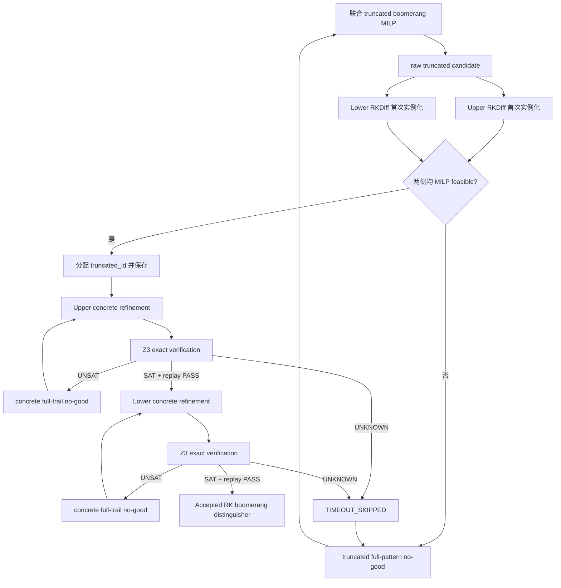

# Splight RK-Boomerang 搜索模型

> [!abstract]
> 本模型在相关密钥环境下搜索 Splight 的 boomerang/sandwich distinguisher。搜索分为三层：nibble 级 truncated MILP 决定 activity pattern；bit 级 RKDiff MILP 实例化完整差分值并最小化真实 DDT weight；Z3 用两条真实 Splight 执行证明整个 concrete characteristic 存在共同 witness。最终 accepted 路径必须满足 `MILP feasible + SMT SAT + replay PASS`。

实验数据见 [[Splight-rk-boomerang实验结果]]；程序入口与参数见 [[README_Splight-H-RK]]。

## 1. 问题定义

将区分器写为：

$$
E=E_1\circ E_m\circ E_0,
\qquad (r_0,r_m,r_1)=\bigl(|E_0|,|E_m|,|E_1|\bigr).
$$

> $E_0$ 为 upper concrete differential，$E_1$ 为 lower concrete differential，$E_m$ 为两者相连的 boomerang switch。程序中的总轮数为 $r_0+r_m+r_1$。

相关密钥差分使用两条独立 key schedule：upper 的主密钥差分记为 $\Delta K$，lower 的主密钥差分记为 $\nabla K$。默认 `rk_mode=rk-ladder` 进一步禁止 $E_m$ 同一 key-schedule S-box 在 upper 和 lower 同时活跃。



### 1.1 分层设计动机

| 模块 | 设计动机 | 技术作用 |
|---|---|---|
| Truncated MILP | 直接枚举 4-bit 差分值的搜索空间过大 | 先确定零/非零 support，并联合优化 E0、Em、E1 |
| RKDiff MILP | Activity 无法给出具体 DDT transition 与 probability weight | 在固定 support 内实例化状态和密钥差分，保持原 objective 搜索最小 weight |
| Z3 exact verifier | 局部 DDT 均可行不代表整条路径共享同一真实状态/主密钥 witness | 同时约束两条真实 Splight 执行，排除全局不可实现的 concrete characteristic |
| 两级 no-good | 单条 concrete 或 truncated path 失败不应否定整个搜索空间 | 只删除当前完整 assignment，复用原 Gurobi model 继续枚举 |

## 2. Splight 轮函数

### 2.1 状态更新

64-bit 状态按 4-bit nibble 表示为：

$$
X_r=L_r\parallel R_r,
\qquad L_r,R_r\in\mathbb F_2^{32}.
$$

一轮内部变量与实现命名为：

$$
\begin{aligned}
Y_r  &= S(L_r),\\
P_r  &= \mathcal L(Y_r),\\
A_r  &= P_r\oplus RK_r,\\
Z_r  &= S(A_r),\\
L_{r+1} &= \operatorname{SHI}^{2}(Z_r\oplus R_r),\\
R_{r+1} &= L_r.
\end{aligned}
$$

> 代码字段依次为 `x_r`、`y_r`、`l_r`、`ak_r`、`z_r`；文档中的 $P_r$ 对应代码 `l_r`，$A_r$ 对应 `ak_r`。`x_r` 始终按内部状态 $L_r\parallel R_r$ 输出，而不是最终密文交换后的 $R_r\parallel L_r$。

### 2.2 线性层

对每组 4 个 nibble $(y_0,y_1,y_2,y_3)$：

$$
\begin{aligned}
t   &= y_0\oplus y_2,\\
l_0 &= t\oplus y_3=l_3\oplus y_3,\\
l_1 &= y_0,\\
l_2 &= y_1\oplus y_2,\\
l_3 &= y_0\oplus y_2.
\end{aligned}
$$

该等价式只使用 2-input XOR；模型不再为原始 3-input 表达式额外建立不必要变量。

### 2.3 相关密钥调度

128-bit key state 写为：

$$
KS_g=K_{0,g}\parallel K_{1,g}\parallel K_{2,g}\parallel K_{3,g}.
$$

对 $K_{0,g}$ 的 nibble 位置 3、7 应用同一个 Splight S3，再左循环移位 1 nibble：

$$
C_g^{key}=\operatorname{SHI}^{1}\bigl(S_{3,7}(K_{0,g})\bigr).
$$

密钥状态更新为：

$$
\begin{aligned}
K_{0,g+1}&=C_g^{key}\oplus K_{1,g}\oplus C_g,\\
K_{1,g+1}&=K_{2,g},\\
K_{2,g+1}&=K_{3,g},\\
K_{3,g+1}&=K_{0,g}.
\end{aligned}
$$

> $C_g$ 是轮常数，在差分中抵消。第 $r$ 个 local encryption round 使用更新后的 `KS_global_(round_offset+r+1)` 的前 8 个 nibble，即 `round_ks_r`；`KS_global_0` 是主密钥输入状态，不是第 0 轮使用的 round-key state。

## 3. Truncated Boomerang MILP

### 3.1 Activity 变量

每个 nibble 只保留一个二进制 activity bit：0 表示差分为 0，1 表示差分非 0。

| 变量族 | 数量/轮 | 含义 |
|---|---:|---|
| `ux_r_i`, `vx_r_i` | 16 | upper/lower 64-bit 状态 activity |
| `uy_r_i`, `vy_r_i` | 8 | 第一层状态 S-box 输出 activity |
| `ul_r_i`, `vl_r_i` | 8 | 线性层输出 activity |
| `urk_r_i`, `vrk_r_i` | 8 | round-key activity |
| `uak_r_i`, `vak_r_i` | 8 | AddRoundKey 后 activity |
| `uz_r_i`, `vz_r_i` | 8 | 第二层状态 S-box 输出 activity |
| `uks_g_i`, `vks_g_i` | 32 | 128-bit global key-state activity |
| `ukc_g_i`, `vkc_g_i` | 8 | key-core activity；只有位置 3、7 是独立 S-box 输出 |
| `s_m_i` | 16 | $E_m$ 第 $m$ 轮共同活跃状态 S-box |
| `ks_common_m_j` | 2 | $E_m$ 第 $m$ 轮共同活跃 key-schedule S-box |

其中 upper truncated trail 覆盖 $r_0+r_m$ 轮，lower truncated trail 覆盖 $r_m+r_1$ 轮。中间第 $m$ 轮对应 upper 的 $r_0+m$ 与 lower 的 $m$。

### 3.2 S-box activity

Splight S3 是双射，因此 nibble 输入差分是否为 0 与输出差分是否为 0 一致：

$$
a=b.
$$

truncated 层不选择具体 DDT transition，只传播 activity；具体输入/输出差分值留给 RKDiff。

### 3.3 两类 truncated XOR

#### E0/E1：允许抵消

对 $c=a\oplus b$ 的 activity relaxation：

$$
\begin{aligned}
a+b-c&\ge 0,\\
a-b+c&\ge 0,\\
-a+b+c&\ge 0.
\end{aligned}
$$

> 允许 $(a,b,c)=(1,1,0)$ 与 $(1,1,1)$，表示两个活跃具体差分可能抵消，也可能不抵消。实现为 `RKTruncDiff.constraint_by_trunc_xor()`。

#### Em：不考虑抵消

$$
\begin{aligned}
c-a&\ge 0,\\
c-b&\ge 0,\\
a+b-c&\ge 0.
\end{aligned}
$$

> 该约束等价于 $c=a\lor b$，可行点为 000、011、101、111。它用于 $E_m$ 的状态传播、线性层、AddRoundKey 和 key schedule XOR，实现为 `RKTruncatedBoomerang.constraint_by_xor()`。

### 3.4 共同活跃 S-box

对 upper/lower activity $u,v$ 和共同活跃变量 $s=u\land v$：

$$
u-s\ge0,\qquad v-s\ge0,\qquad -u-v+s\ge-1.
$$

`rk-ladder` 对两个 key-schedule S-box 额外加入：

$$
u^{key}_{m,j}+v^{key}_{m,j}\le1,
$$

因此当前模式下 `ks_common_m_j=0`。模型仍保留该变量，使 state/key common 的统计和其他 `rk_mode` 扩展保持统一。

### 3.5 Truncated 目标函数

$$
J_T=
w_0\sum_{r=0}^{r_0-1}A^u_r+
w_m\sum_{r=0}^{r_m-1}\left(C^{state}_r+C^{key}_r\right)+
w_1\sum_{r=r_m}^{r_m+r_1-1}A^l_r.
$$

> $A^u_r,A^l_r$ 是该轮两层状态 S-box 的活跃数，每轮最多 16；$C^{state}_r,C^{key}_r$ 是 middle common 数。当前 truncated 目标不把 E0/E1 的普通 key-schedule activity 计入 $w_0,w_1$ 项；key-schedule 的真实 probability weight 在 bit-level RKDiff 中计入。

模型同时排除全零状态差分和全零主密钥差分，并要求 E0/E1 边界保持非平凡。

## 4. Bit-Level RKDiff MILP

### 4.1 Concrete 变量

每个 nibble $V$ 用 4 个 binary bit 表示：

$$
V=(V_0,V_1,V_2,V_3),
$$

其中 `_0` 是 MSB，`_3` 是 LSB。

| 变量 | 含义 |
|---|---|
| `x_r_i_b` | round boundary state difference |
| `y_r_i_b` | 第一层 S-box 输出差分 |
| `l_r_i_b` | 线性层输出差分 |
| `rk_r_i_b` | 当前 encryption round-key 差分 |
| `ak_r_i_b` | `l XOR rk` 的差分 |
| `z_r_i_b` | 第二层 S-box 输出差分 |
| `ks_g_i_b` | global 128-bit key-state 差分 |
| `kc_g_i_b` | key-core S-box 输出差分 |
| `pr_h_0..2` | 第 $h$ 个 S-box transition 的 DDT weight 编码 |
| `d_*` | 多输入 XOR 分解时的临时 concrete bit；不进入 trail signature |

### 4.2 Exact bit XOR

对 binary bits $w=u\oplus v$：

$$
\begin{aligned}
u+v+w&\le2,\\
u+v-w&\ge0,\\
u-v+w&\ge0,\\
-u+v+w&\ge0.
\end{aligned}
$$

该约束逐 bit 应用于状态轮函数、线性层、AddRoundKey、Feistel XOR 和 key schedule。

### 4.3 S3 DDT 与 weight

设 S-box 输入/输出差分为 4-bit 向量 $a=(a_0,ldots,a_3)$、$b=(b_0,ldots,b_3)$。`RKDiff.sbox_inequalities` 保存固定的 25 条 convex-hull 不等式；`constraints_by_sbox(di,do,pr)` 只执行以下替换：

```text
a0..a3  -> 当前输入差分 bit
b0..b3  -> 当前输出差分 bit
pr0..pr2 -> 当前 transition 的 weight bit
```

例如其中一组约束为：

$$
\begin{aligned}
-a_0-2a_1-a_2-a_3+b_1+b_2+pr_0+3pr_2&\ge0,\\
a_1+b_3-pr_0&\ge0,\\
pr_1-pr_2&\ge0,\\
-pr_1+pr_2&\ge0.
\end{aligned}
$$

完整系统精确编码 S3 的 97 个非零 DDT transition；可行 weight 仅为 0、2、3，transition probability 为：

$$
\Pr[a\rightarrow b]=2^{-w(a,b)},
\qquad w(a,b)=pr_0+pr_1+pr_2.
$$

### 4.4 Concrete 目标函数

$$
J_D=\sum_{h\in\mathcal S_{state}\cup\mathcal S_{key}}w_h.
$$

upper 的目标包含其 local rounds 所需的状态 S-box 和 key-schedule S-box weight。lower 为了从真实主密钥导出非零 `round_offset` 的 round keys，仍约束绝对轮 0 到末轮的完整 key schedule；但目标只统计 E1 区间，即 tag 的 absolute key round 满足 `round >= round_offset`。

固定 truncated support 时：

$$
T_i=0\Rightarrow V_i=0000,
\qquad
T_i=1\Rightarrow \sum_{b=0}^{3}V_{i,b}\ge1.
$$

该约束应用于 `x,y,l,rk,ak,z,ks_global,kc_global`，并在送入 Z3 前再次执行 support consistency check。

## 5. Round Offset

| 部分 | concrete 轮数 | `round_offset` | local round 0 使用的 absolute key round |
|---|---:|---:|---:|
| Upper $E_0$ | $r_0$ | 0 | 0 |
| Lower $E_1$ | $r_1$ | $r_0+r_m$ | $r_0+r_m$ |

lower verifier 仍从两个真实 master keys 的 `KS_global_0` 开始正向生成 key schedule，只是先推进到 `round_offset`。这避免把 lower 的局部 key state 错当成新的 master key。

## 6. Z3 Exact Verification

局部 DDT transition 均可行并不保证所有轮能由同一组真实状态与主密钥同时实现。Z3 为 candidate 建立两条真实执行：

$$
(X_A,K_A),\qquad(X_B,K_B),
$$

并对每个导出的 concrete difference 固定：

$$
\Delta V=V_A\oplus V_B.
$$

`fixed_diffs` 包含：

- `dK`、全部 `dKSGg`；
- 全部 global key-core 的 `dKSGINg`、`dKSGOUTg`、`dKSGCOREg`；
- 每轮 `dXr`、`dKSr`、`dROUNDKSr`、`dRKr`；
- 每轮 `dYr`、`dLINr`、`dAKr`、`dZr`、`dFXORr`、`dSHIr`；
- local key-core 的 `dKSINr`、`dKSOUTr`、`dKCOREr`。

状态语义严格区分为：

| Z3 状态 | 处理 |
|---|---|
| `SAT + replay PASS` | 接受 candidate，并保存真实 state/master-key witness |
| `UNSAT` | 保存 candidate；仅排除这一条完整 concrete assignment；同一 RKDiff model 重新 optimize |
| `UNKNOWN` | 不排除 candidate；当前 truncated path 标记 `TIMEOUT_SKIPPED` |
| `SAT + replay FAIL` | `MODEL_INCONSISTENCY`，立即停止，不添加 no-good |

## 7. 两级 No-Good

对当前 binary assignment $b_i^*\in\{0,1\}$，统一使用 Hamming-distance 至少为 1：

$$
\sum_{i:b_i^*=0}b_i+
\sum_{i:b_i^*=1}(1-b_i)\ge1.
$$

### 7.1 Concrete full-trail no-good

signature 包含 `x,ks,y,l,rk,ak,z,kc` 的全部 concrete difference bits；不包含 `pr`、objective、activity helper 和 XOR 临时变量。该约束只加入当前 RKDiff model，因此：

- 不改变 truncated support；
- 不判断某个局部 S-box transition 永远非法；
- 不修改 objective；
- 下一 candidate 可以保持相同 weight，只需至少一个 concrete difference bit 改变。

### 7.2 Truncated full-pattern no-good

signature 包含 `ux/uy/ul/urk/uak/uz/uks/ukc`、对应 lower `v*`、`s_*` 和 `ks_common_*` activity bits；不包含 concrete hex difference 和临时 XOR helper。当前 path concrete exhausted 或 timeout-skipped 后，将该约束加入同一个 truncated Gurobi model，再搜索下一条 activity pattern。

## 8. 双层搜索伪算法

```text
build one truncated Gurobi model M_T

while M_T has a raw solution T:
    build upper RKDiff M_U(T)
    build lower RKDiff M_L(T)
    solve first candidate on both sides

    if either side has no MILP solution:
        add full truncated no-good(T) to M_T
        continue

    assign truncated_id and save T

    for side/model in [(upper, M_U), (lower, M_L)]:
        while model has a concrete candidate C:
            assert support(C) == support(T)
            result = Z3_verify_all_differences(C)

            if result == SAT and replay == PASS:
                accept C
                break
            if result == UNSAT:
                save C
                add full concrete no-good(C) to the same RKDiff model
                continue
            if result == UNKNOWN:
                mark T as TIMEOUT_SKIPPED
                break
            otherwise:
                stop with MODEL_INCONSISTENCY

    if upper and lower are both accepted:
        return SUCCESS

    add full truncated no-good(T) to M_T

return NO_EXACT_REALIZABLE_TRAIL
       or SEARCH_INCOMPLETE_TIMEOUT
```

## 9. 概率解释

accepted concrete characteristics 给出：

$$
p=2^{-W_u},\qquad q=2^{-W_l}.
$$

当前 Hadipour middle 上界估计使用：

$$
r_{ub}=2^{-2CAS}.
$$

因此：

$$
P_{boom}\approx p^2rq^2,
\qquad
P_{boom}^{ub}=2^{-(2W_u+2W_l+2CAS)}.
$$

> Z3 SAT 证明 characteristic 有真实 witness，但不证明 differential effect、boomerang independence 或 $r$ 的精确值。实际 $\hat p,\hat q,\hat r$ 由 `probability/rk_probability_evaluator.py` 调用现有相关密钥实验实现估计。

## 10. 实现映射

| 模块 | 职责 |
|---|---|
| [[rktruncdiff.py]] | 单侧 nibble-level related-key truncated differential |
| [[rktruncboom.py]] | 联合 upper/lower middle、truncated 目标、activity no-good |
| [[rkdiff.py]] | bit-level concrete RK differential、DDT weight、concrete no-good |
| [[rkboom.py]] | raw preflight、outer/inner loop、结果保存、时间限制与概率入口 |
| [[tools/rk_exact_verify.py]] | 两条真实 Splight 执行、SAT/UNSAT/UNKNOWN 与 replay |
| [[keydiff.py]] | 独立 key-schedule differential MILP 推导 |
| `Splight_implement/implement_py/enc.py` | 概率实验和 replay 对照的 executable Splight 定义 |

## 11. 边界与限制

1. truncated middle 采用“不考虑 XOR 抵消”的 Hadipour activity 模型，因此是保守结构约束，不是所有具体差分传播的精确枚举。
2. `rk-ladder` 明确禁止 middle key-schedule S-box 同时活跃；若研究其他 related-key 结构，应以新的 `rk_mode` 明确建模，不能直接把当前结果外推。
3. full-trail no-good 可能需要枚举大量 candidate；它保证删除操作安全，但不利用 UNSAT core 定位局部冲突。
4. 单个 MILP 受 `--tl` 限制；整体搜索受 `--global-tl` 限制；`--probtest t` 的实验时间不计入求解限制。
5. 只有 `SAT + replay PASS` 才写入 exact accepted trail；`TIMEOUT_SKIPPED` 不能解释为不可实现。
